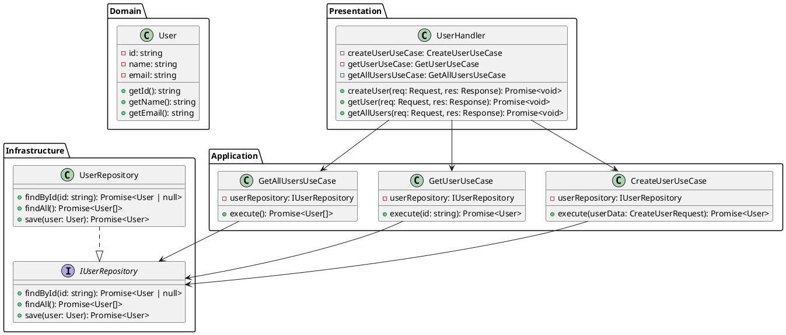
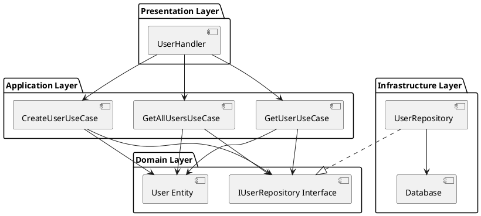

# クラス図

## ドメインモデル

```plantuml
@startuml
package "Domain" {
  class User {
    -id: string
    -name: string
    -email: string
    +getId(): string
    +getName(): string
    +getEmail(): string
  }
}

package "Application" {
  class CreateUserUseCase {
    -userRepository: IUserRepository
    +execute(userData: CreateUserRequest): Promise<User>
  }
  
  class GetUserUseCase {
    -userRepository: IUserRepository
    +execute(id: string): Promise<User>
  }
  
  class GetAllUsersUseCase {
    -userRepository: IUserRepository
    +execute(): Promise<User[]>
  }
}

package "Infrastructure" {
  interface IUserRepository {
    +findById(id: string): Promise<User | null>
    +findAll(): Promise<User[]>
    +save(user: User): Promise<User>
  }
  
  class UserRepository {
    +findById(id: string): Promise<User | null>
    +findAll(): Promise<User[]>
    +save(user: User): Promise<User>
  }
}

package "Presentation" {
  class UserHandler {
    -createUserUseCase: CreateUserUseCase
    -getUserUseCase: GetUserUseCase
    -getAllUsersUseCase: GetAllUsersUseCase
    +createUser(req: Request, res: Response): Promise<void>
    +getUser(req: Request, res: Response): Promise<void>
    +getAllUsers(req: Request, res: Response): Promise<void>
  }
}

UserRepository ..|> IUserRepository
CreateUserUseCase --> IUserRepository
GetUserUseCase --> IUserRepository
GetAllUsersUseCase --> IUserRepository
UserHandler --> CreateUserUseCase
UserHandler --> GetUserUseCase
UserHandler --> GetAllUsersUseCase
@enduml
```

## 依存関係

```plantuml
@startuml
package "Presentation Layer" {
  [UserHandler]
}

package "Application Layer" {
  [CreateUserUseCase]
  [GetUserUseCase]
  [GetAllUsersUseCase]
}

package "Domain Layer" {
  [User Entity]
  [IUserRepository Interface]
}

package "Infrastructure Layer" {
  [UserRepository]
  [Database]
}

[UserHandler] --> [CreateUserUseCase]
[UserHandler] --> [GetUserUseCase]
[UserHandler] --> [GetAllUsersUseCase]

[CreateUserUseCase] --> [User Entity]
[GetUserUseCase] --> [User Entity]
[GetAllUsersUseCase] --> [User Entity]

[CreateUserUseCase] --> [IUserRepository Interface]
[GetUserUseCase] --> [IUserRepository Interface]
[GetAllUsersUseCase] --> [IUserRepository Interface]

[UserRepository] ..|> [IUserRepository Interface]
[UserRepository] --> [Database]
@enduml
```