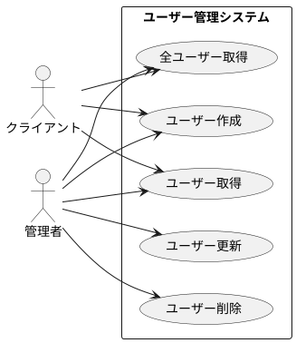
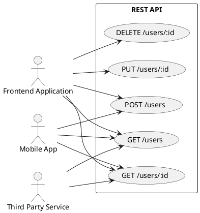
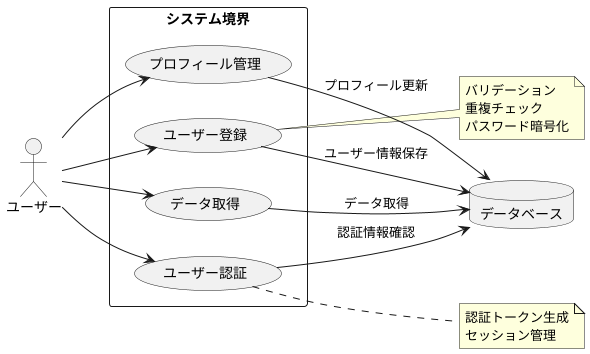

# ユースケース図

## ユーザー管理システム

```plantuml
@startuml
left to right direction
skinparam packageStyle rectangle

actor "クライアント" as Client
actor "管理者" as Admin

rectangle "ユーザー管理システム" {
  usecase "ユーザー作成" as UC1
  usecase "ユーザー取得" as UC2
  usecase "全ユーザー取得" as UC3
  usecase "ユーザー更新" as UC4
  usecase "ユーザー削除" as UC5
}

Client --> UC1
Client --> UC2
Client --> UC3

Admin --> UC1
Admin --> UC2
Admin --> UC3
Admin --> UC4
Admin --> UC5

@enduml
```

## API エンドポイント

```plantuml
@startuml
left to right direction
skinparam packageStyle rectangle

actor "Frontend Application" as Frontend
actor "Mobile App" as Mobile
actor "Third Party Service" as ThirdParty

rectangle "REST API" {
  usecase "POST /users" as POST_Users
  usecase "GET /users/:id" as GET_User
  usecase "GET /users" as GET_Users
  usecase "PUT /users/:id" as PUT_User
  usecase "DELETE /users/:id" as DELETE_User
}

Frontend --> POST_Users
Frontend --> GET_User
Frontend --> GET_Users
Frontend --> PUT_User
Frontend --> DELETE_User

Mobile --> POST_Users
Mobile --> GET_User
Mobile --> GET_Users

ThirdParty --> GET_User
ThirdParty --> GET_Users

@enduml
```

## データフロー

```plantuml
@startuml
left to right direction

actor "ユーザー" as User

rectangle "システム境界" {
  usecase "ユーザー登録" as Register
  usecase "ユーザー認証" as Auth
  usecase "プロフィール管理" as Profile
  usecase "データ取得" as GetData
}

database "データベース" as DB

User --> Register
User --> Auth
User --> Profile
User --> GetData

Register --> DB : ユーザー情報保存
Auth --> DB : 認証情報確認
Profile --> DB : プロフィール更新
GetData --> DB : データ取得

note right of Register
  バリデーション
  重複チェック
  パスワード暗号化
end note

note right of Auth
  認証トークン生成
  セッション管理
end note
@enduml
```